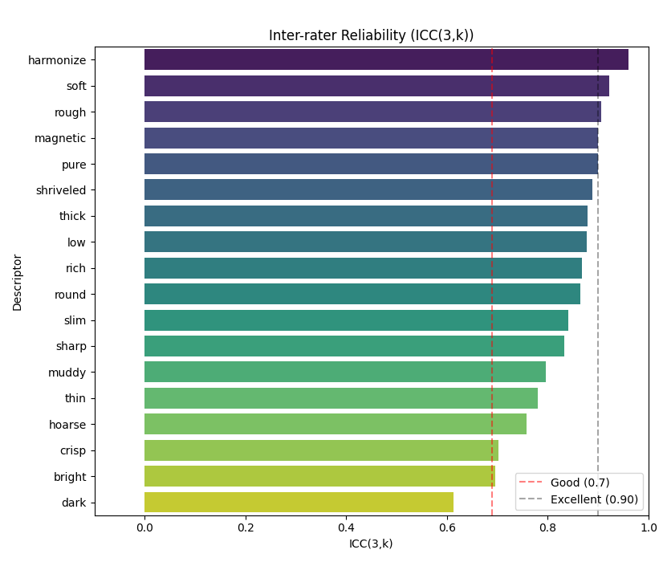

# Reference-free Singing Voice Timbre Attribute Prediction via Perception Informed Network

Research repository for our work on **reference-free singing voice timbre attribute prediction**, bringing together the **SDVED-TDA dataset annotations, inference code, and training code**.

For more details of our work, please see :

## Overview

Our framework predicts interpretable timbre attributes from a singing recording without requiring a reference performance. It combines a **256-dimensional frozen FACodec timbre embedding** with **44-dimensional handcrafted perceptual features**, followed by descriptor-specific MLP prediction heads.

Transfer learning from instrument and speech timbre datasets supports adaptation to singing with limited annotated data. The prediction experiments focus on five attributes: **Bright, Thick, Soft, Pure, and Magnetic**.

The handcrafted features comprise spectral centroid, spectral flux, harmonic-to-noise ratio (HNR), formant frequencies F1/F2, and 39-dimensional MFCC features. During transfer, the first two MLP layers are frozen while the remaining layers are fine-tuned on singing data.

## SDVED-TDA : Singing Dry Voice Evaluation Database with Timbre Descriptor Annotations

**SDVED-TDA** adds sample-level perceptual timbre annotations to the **Singing Dry Voice Evaluation Database (SDVED)**, part of the CCMusic database. While the original SDVED provides overall timbre scores, SDVED-TDA describes each singing sample using 18 timbre attributes.

This repository provides the **annotation labels** and an inter-rater reliability figure. Audio recordings, model code, and pretrained weights are not included in this release.


### Dataset overview

| Property | Description |
| --- | --- |
| Annotated samples | 132 |
| Singers | 22 |
| Samples per singer | 6 |
| Annotators | 15 trained musicians |
| Timbre descriptors | 18 |
| Rating scale | 1–10 |
| Label representation | Sample-level, annotator-averaged descriptor scores |
| File format | UTF-8 JSON |

Each sample has its own timbre attribute vector. Labels are not shared across all recordings from the same singer, allowing the annotations to preserve performance-dependent timbre variation.

## Repository contents

```text
SDVED-TDA/
├── README.md
├── SDVED_TDA.json    # Sample-level timbre attribute labels
└── ICC_pic.png       # Inter-rater reliability figure
```

The labels are available in [SDVED_TDA.json](SDVED_TDA.json).

## Annotation procedure

Fifteen trained musicians (eight males and seven females, aged 20–30) participated in the listening study. Their average musical experience was 15.9 years.

Each participant was presented with 132 singing samples and instructed to listen to each complete sample before rating its 18 timbre attributes on a 1–10 scale. The audio sample order was randomized, and the descriptor order was shuffled for each sample to reduce potential anchoring effects.

The released JSON contains aggregated descriptor scores for each sample. Individual annotator ratings and per-score response counts are not included.

### Timbre descriptors

The release retains all **18 annotated descriptors**. The JSON keys are listed below exactly as stored in the file.

| JSON key | Descriptor |
| --- | --- |
| `bright` | Bright |
| `crisp` | Crisp |
| `dark` | Dark |
| `harmonize` | Harmonious |
| `hoarse` | Hoarse |
| `low` | Low |
| `magnetic` | Magnetic |
| `muddy` | Muddy |
| `pure` | Pure |
| `rich` | Rich |
| `rough` | Rough |
| `round` | Round |
| `sharp` | Sharp |
| `shriveled` | Shriveled |
| `slim` | Slim |
| `soft` | Soft |
| `thick` | Thick |
| `thin` | Thin |

**Naming note:** The descriptor called *Harmonious* in the manuscript is stored under the key `harmonize`. Use `harmonize` when reading the JSON.

The associated study selected **Bright, Thick, Soft, Pure, and Magnetic** for its prediction experiments, based on questionnaire responses about recommended descriptors and similar/opposite descriptor pairs. This five-dimensional experimental subset does not replace the full 18-descriptor annotation release.

### Inter-rater reliability

Inter-rater reliability was assessed using **ICC(3,k)**. As reported in the manuscript, all descriptors except **Dark** achieved ICC values above 0.7.



## Label format

`SDVED_TDA.json` is a JSON array with **132 objects**. Each object contains an `audioFile` string and 18 numeric descriptor scores.

The first record is shown below:

```json
{
  "audioFile": "audio/DH/DH_但愿人长久.wav",
  "bright": 4.1333333333,
  "crisp": 2.5384615385,
  "dark": 4.0666666667,
  "harmonize": 1.4285714286,
  "hoarse": 6.4666666667,
  "low": 4.8666666667,
  "magnetic": 2.8666666667,
  "muddy": 7.2666666667,
  "pure": 2.6666666667,
  "rich": 4.4166666667,
  "rough": 7.4166666667,
  "round": 3.1333333333,
}
```

`audioFile` identifies the corresponding recording using this relative path convention:

```text
audio/<singer_id>/<singer_id>_<song_title>.wav
```

For example, `DH` is the singer identifier in the record above. The path is a reference to the recording, not a download URL. The repository does not contain an `audio/` directory; obtain the original SDVED audio separately from its provider and match the recordings to these identifiers. Preserve the Chinese characters in filenames when matching files.
## Loading the labels

Download or clone this repository, then run the following Python code from its root directory. Only the Python standard library is required.

```python
import json
from pathlib import PurePosixPath

with open("SDVED_TDA.json", "r", encoding="utf-8") as f:
    records = json.load(f)

# Use an explicit order when constructing label vectors.
descriptors = [
    "bright", "crisp", "dark", "harmonize", "hoarse", "low",
    "magnetic", "muddy", "pure", "rich", "rough", "round",
    "sharp", "shriveled", "slim", "soft", "thick", "thin",
]

audio_paths = [record["audioFile"] for record in records]
singer_ids = [PurePosixPath(path).parent.name for path in audio_paths]
labels = [[record[key] for key in descriptors] for record in records]

print(f"Samples: {len(records)}")            # 132
print(f"Singers: {len(set(singer_ids))}")    # 22
print(f"Descriptors: {len(descriptors)}")   # 18

# Optional: select the five dimensions used in the paper.
paper_descriptors = ["bright", "thick", "soft", "pure", "magnetic"]
paper_labels = [
    [record[key] for key in paper_descriptors]
    for record in records
]
```
## Evaluation notes

- These labels describe perceived timbre attributes, rather than a single overall singing quality score.
- The manuscript uses an 80%/20% train/test partition at the singer level. Keep samples from the same singer together when constructing evaluation splits to avoid singer overlap.
- This release does not include predefined split assignments or a split seed. A newly generated split should not be assumed to reproduce the paper's exact partition.
- The dataset is limited to 132 samples from 22 singers; consider this scope when interpreting generalization results.

## Training and reproduction

The planned training release will cover the complete workflow:

1. **Prepare data:** load CTIS and VCTK-RVA source-domain annotations and SDVED-TDA target-domain labels; resolve audio paths and apply the experiment splits.
2. **Prepare source labels:** convert VCTK-RVA pairwise comparisons using the regularized Bradley–Terry procedure and document descriptor mappings across datasets.
3. **Extract features:** compute frozen FACodec timbre embeddings and the 44-dimensional handcrafted feature vectors.
4. **Train source models:** optimize descriptor-specific prediction heads using the source-domain data.
5. **Fine-tune on singing:** freeze the first two MLP layers and adapt the remaining layers using descriptor-specific learning rates.
6. **Evaluate:** report descriptor-wise errors and the aggregate MAE statistics used in the manuscript.

Configuration files will specify preprocessing, model architecture, feature statistics, optimizer and scheduler settings, descriptor mappings, model groups, random seeds, and data splits. Exact split manifests are needed to reproduce the reported partition; a random seed alone does not describe that partition independently of the split implementation and sample order.


## Citation
If you use our SDVED-TDA dataset or other referring codes, please cite the following paper:
```latex
@inproceedings{yuan2026reference,
  title={Reference-free Singing Voice Timbre Attribute Prediction via Perception Informed Network},
  author={Hsi-Min Yuan, Pei-Chin Hsieh, Yih-Liang Shen, Tai-Shih Chi},
  booktitle={2026 Asia Pacific Signal and Information Processing Association Annual Summit and Conference (APSIPA ASC)},
  pages={1--6},
  year={2026},
  organization={IEEE}
}

```
## Contact
For questions about the dataset or implementation, please open an issue in this repository or contact :

**Hsi-Min Yuan** at **simon4ni.ee13@nycu.edu.tw**.

**Perceptual Signal Process Lab @ National Yang Ming Chiao Tung Univeristy** at **percept711@gmail.com**.
